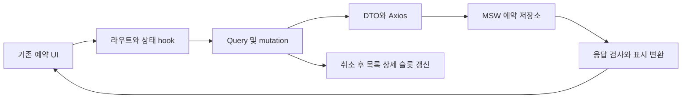

# 이력서·포트폴리오 기록

## 사례 1 — 서버 명세가 없는 예약 화면의 mock 기반 데이터 흐름 구현

- 작업 유형: 프로젝트 구현
- 관련 도메인/서비스: 회의 예약 목록·상세·취소·신규 예약 제한
- 문제 출처: 사용자 요구, UI handoff, 현재 코드 조사

### 문제 상황

예약 UI는 구현됐지만 목록·상세 API와 라우트가 없어 실제 데이터 흐름으로 화면을 확인할 수 없었다. 서버 명세도 없었다. 기존 신청 mock은 날짜가 과거로 고정돼 시간이 흐르면 폼 검증을 통과하지 못하는 구조였다.

### 고민과 선택

사용자는 UI 세션이 화면 명세를 바탕으로 작성한 추정 요청·응답을 mock의 기준으로 지정했다. UI에 fixture를 직접 주입하는 방법은 HTTP·파싱·query 흐름을 확인하지 못하므로 기존 ApiClient·Zod·TanStack Query·MSW를 확장했다. 추정 계약을 실제 서버 확정 명세로 취급하지 않도록 기록했다.

### 적용

예약 feature api에 목록·상세·취소·제한 스키마와 parser를 추가했다. MSW는 신청과 취소 상태를 같은 저장소에 반영하고 예약자·상태·시작 5분 전 조건을 최종 요청에서 검사한다. hook은 취소 후 관련 query를 무효화하고, 예약 제한 오류에서는 제한 상태를 재조회한다. pages에서 기존 controlled UI 및 팝업에 연결했다.

### 사용 기술과 구체적 목적

| 기술 | 구체적 목적 |
| --- | --- |
| Zod DTO·parser | 6개 상태, 숫자 10자리 코드, 1시간 슬롯과 상태 정합성을 검사하고 표시 문자열로 변환 |
| 기존 Axios ApiClient | 인증 옵션과 공통 응답 봉투를 유지한 HTTP 계약 검증 |
| TanStack Query | 탭·페이지·ID 캐시 분리, AbortSignal 전달, 신청·취소 후 데이터 갱신 |
| MSW factory와 시각 주입 | 상태 전이·오류·빈 목록·제한·마감 경계를 결정적으로 재현 |
| Vitest·jsdom | 실제 HTTP→hook→라우트→팝업 연결 및 중복 취소 방지 검증 |

### 결과

목록·상세·취소·제한 흐름의 예약 관련 테스트 72개, 최종 lint와 마지막 수정 후 TypeScript·Vite 빌드가 통과했다. 전체 테스트는 565개 통과·기존 시민참여 6개 실패다. 실제 서버 연동·배포·운영 성과를 측정한 작업은 아니다. 사용자 후속 피드백은 현재 결과로 병합하고 sy-main 통합 소유권을 반납하라는 요청이다. 검증된 26개 변경을 `2184467`로 커밋했고, 별도 승인된 종료 복구로 sy-main의 이전 통합 소유권을 해제했다. 예약 변경의 병합은 부모 Claude 소유권 조정이 남아 있다.

### 이력서·포트폴리오 문구

- 화면 명세에서 도출한 추정 DTO와 MSW를 활용해 예약 목록·상세·취소·제한 흐름을 구현하고 관련 72개 테스트로 검증.
- 서버 명세 부재 상황에서 기존 UI를 재사용해 HTTP 계약과 상태 전이를 연결했다. 시각 주입으로 마감 경계를 재현하고 신청·취소 이후 캐시 갱신을 확인했으며 타입·빌드 검증을 통과했다. 실제 backend 계약 대조는 후속 단계로 남아 있다.
